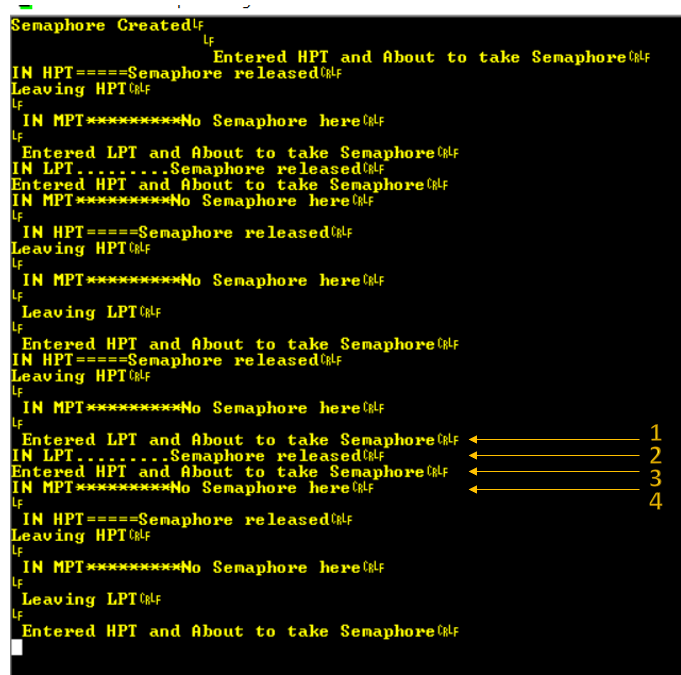

# PriorityBoosting

Priority Boosting algorithm to solve priority inversion problem

----

The problem of priority inverison is solved because whenever a call to mysemaphoretake is happening, the priority is boosted temporarily to highest value and then when mysemaphoregive is called the priority is set back to original value.

----

=======
